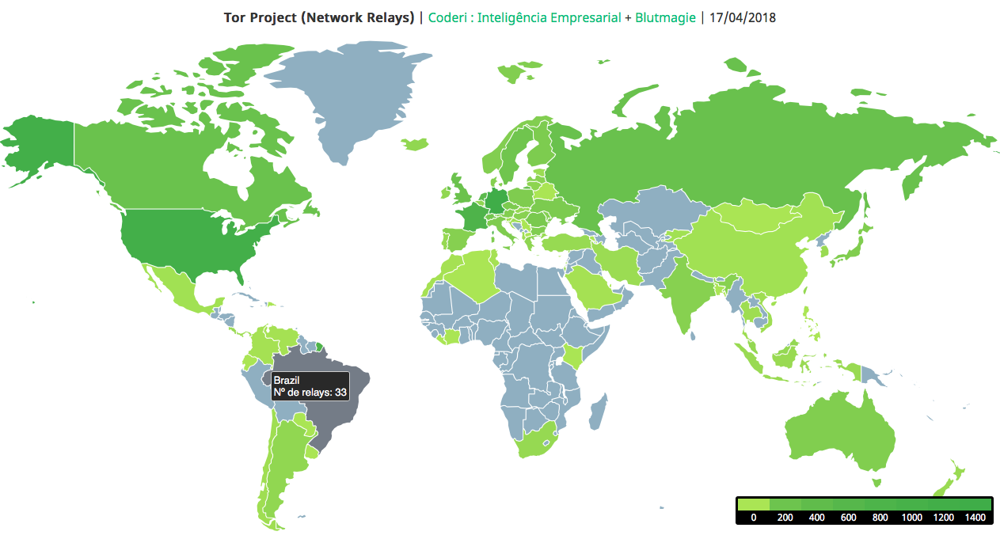

# Tor Project - Relays Locations
Simplified global mapping (world location) of the **Tor Project** nodes network by *Coderi : Inteligência Empresarial*.

#### Sample screen

### Install & Run
* Install dependencies: `npm install`
* Generate Tor hosts data: `npm run export`
* Run local server: `npm run serve` - http://127.0.0.1:8080

### Processing the data
CSV Data: http://blutmagie.de/query_export.php/Tor_query_EXPORT.csv  

Sort, Grouping and Counting (decreasing):  
`curl -s  http://blutmagie.de/query_export.php/Tor_query_EXPORT.csv | awk 'BEGIN { FS = "," } ; { print $2 }' | sort | uniq -c | sort -nr`

* Export JSON data file: `npm run export` (torNodes.json)

### Sources & Technology
* Tor Project - https://www.torproject.org
* Blutmagie - http://blutmagie.de/
* JQuery - https://jquery.com
* JVectorMap - http://jvectormap.com
* Node & NPM - https://nodejs.org
